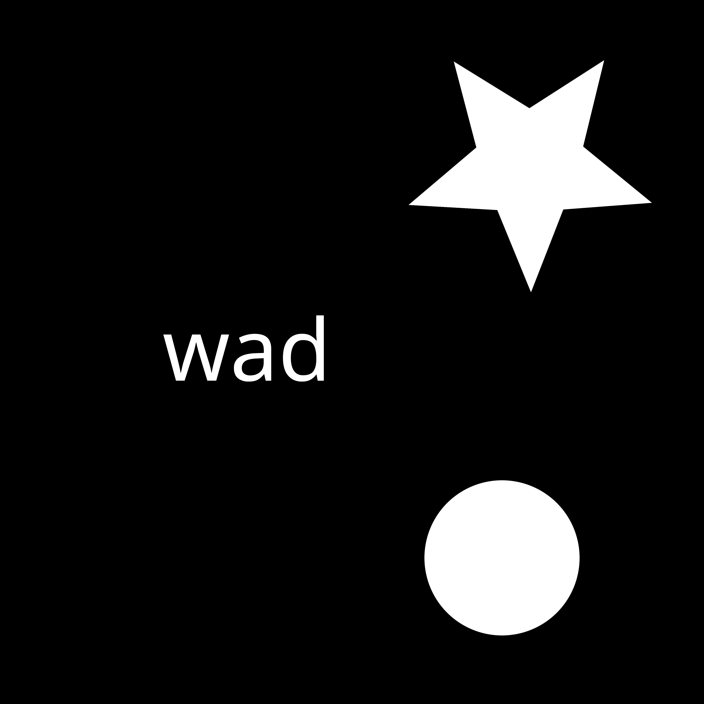
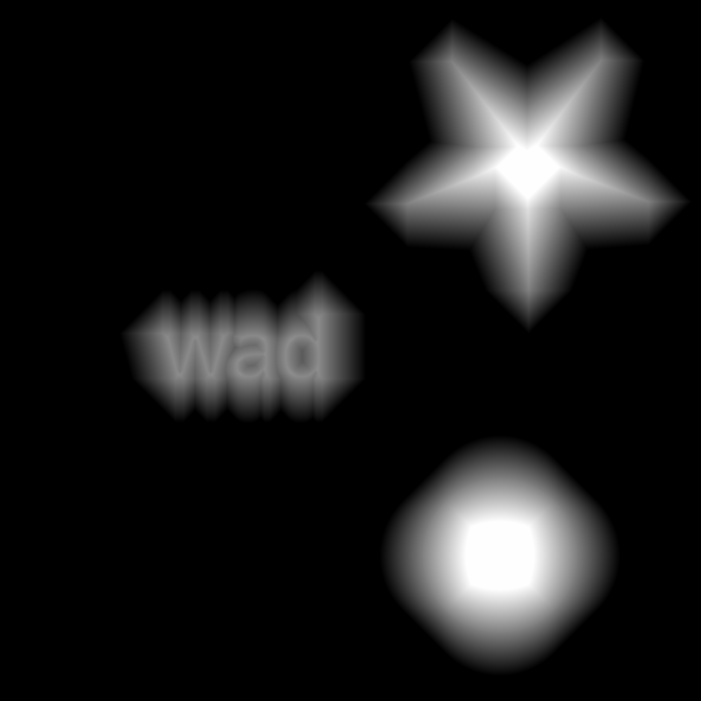

## SDF-JS 
Мои эксперименты по генерации SDF-текстур, реализация на JavaScript. Для расчета карты расстояний использовал алгоритм двух проходов с окном 3x3, поэтому расчет расстояний весьма не точный, что сказывается на финальном результате. 

## Пример: 
Исходное изображение

Результат

